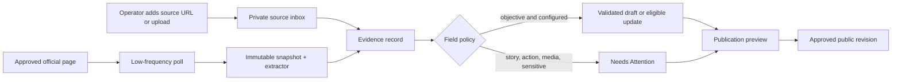

# Content Source and Ingestion Strategy

**Status:** researched V1 recommendation
**Date:** 28 September 2026
**Scope:** how facts, stories, actions, events, and media reach the platform reliably, lawfully, and with minimal recurring cost

## Decision

Use a **source inbox plus selected official-source adapters**. The source inbox is the primary path for stories, social posts, media, and anything editorial or sensitive. Automation is reserved for a very small number of public, official, structured or stable pages where a change is objectively detectable. No social network, news search result, or model output may become a published fact by itself.

This is more reliable than trying to aggregate Malte's social activity: it prevents silent rights/privacy problems, avoids brittle browser automation and third-party scraping costs, and gives the maintainer a single clear place to turn a real-world update into an evidenced draft.



## Research findings and source register candidates

The entries below are observations on 28 September 2026, not approval to publish the claims found there. Joshua adds each selected URL to the source registry and records its use, cadence, and extraction fields. Written source-owner confirmation is not a V1 requirement.

| Candidate | What it can reliably support | Acquisition method | Cadence / cost | Publication policy |
| --- | --- | --- | --- | --- |
| [Wilderness International — MA-Forest](https://en.wilderness-international.org/ma) | campaign description, official donation destination, and its displayed protection counter | dedicated server-rendered page adapter; capture page, extract declared counter and destination separately | conditional `GET`, at most every 6 hours; no paid service | counter may be eligible for validation-based update after field approval; destination always review-only |
| [Wilderness International — ambassadors](https://www.wilderness-international.org/wildnisbotschafter) | a first-party description of the MA-Forest relationship and named public participants | canonical-page snapshot; change detection on the named section | daily | creates evidence-backed draft only; relationship wording never auto-publishes |
| [Wilderness International — 2025 review](https://wilderness-international.org/news/jahresrueckblick-2025) | dated historic milestone and outcome context | one-time seed plus monthly canonical/news discovery | monthly | seed/history review only; no recurring metric extraction from an annual article |
| [MAPHIA — support page](https://maphia.shop/pages/taylt) | the explicit distinction between shop purchases and direct support, and links to trusted organisations | one-time seed plus weekly change check | weekly | review-only; the public site must retain this distinction in its labels |
| [MAPHIA — storefront](https://maphia.shop/) | current shop link and products | link-out only; optional Shopify sitemap/product feed research | daily only if the shop is included in the site | never use a shop listing as a donation or project update; public assets carry original credit |
| Tierbrücke / Notpfote public pages | current operational updates, official action URLs and public events | independently research canonical public pages, feeds, and structured data | source-specific | facts/actions become chat drafts or approved automation fields |
| Publisher/producer pages for books, film, music | release metadata and official public links | one-time manual source entry; RSS/API only if publicly offered | weekly near scheduled release, otherwise none | structured release fields may be drafted; public media carries original credit |
| Individual Instagram URLs | contextual post or Reel shown as an embed | automatically attach an embed when a selected source/update contains a supported canonical URL; request oEmbed only to render it | on add and render revalidation only | embed/reference only; no factual extraction, caption archive, metric collection, or asset copying |

The MA-Forest page appears to be the strongest first automated source: it is maintained by the destination organisation, contains both the current campaign context and an explicit counter, and explains that corrections can make the counter move downward. The adapter must therefore permit downward changes and never treat a decrease as an error or evidence of a failed donation.

MAPHIA's support page explicitly says its shop is not a direct donation channel and directs visitors to selected organisations. This makes it an important label/evidence source, but a poor automated campaign source. The platform should link to the shop as merchandise only and must never count a shop handoff as a donation handoff.

## Ordered acquisition policy

For each source, use the first permitted method that provides the required field. Do not fall through automatically to a more invasive method.

1. **Direct, signed-in editorial entry:** An authorised operator adds a URL, an exact supporting passage/value, observed date, target project, and usage/right status in the source inbox. This is the default for Malte/Phia updates, partner messages, press material, social content, and media. A later V2 partner submission uses this same internal format.
2. **Official webhook or documented API:** A future option when publicly available or authorised for the platform. Verify request signatures, record delivery ID, and enqueue idempotently. V1 does not depend on it.
3. **RSS/Atom, XML sitemap, or canonical JSON-LD:** Poll conditional HTTP headers, then fetch each newly discovered canonical URL. Use feeds/sitemaps for discovery, not as sole evidence when the item page supplies the date, context, or action URL.
4. **Narrow canonical-page adapter:** Fetch a named public page with a stable selector or structured data. Extract only configured fields; version the selector and store a snapshot. The MA-Forest counter adapter is this class.
5. **Manual reference or permitted embed:** Store the original URL and relationship to the project. This is the V1 path for Instagram and most third-party media.

Never use search-engine results, repost accounts, arbitrary HTML discovery, unofficial Instagram/TikTok scrapers, newsletter inbox scraping, login automation, or a generative model as a source of record. They may help a human find a candidate source outside the production platform, but cannot create an ingestion record.

## Source inbox: the central steward workflow

Add an **Add source** control to Joshua’s steward interface before building any automated adapter. Before the reveal, Joshua alone uses it to seed public sources. After the reveal, Malte’s chat can create a private source-inbox draft from a message or link, but the structured source record and automation configuration remain Joshua’s work. It accepts:

- source type (`official page`, `official statement`, `partner message`, `social reference`, `press`, `event`);
- canonical URL, original publication date, and observation time;
- project/entity, concise proposed update, and exact supporting quote/value;
- source authority, public-visibility decision, rights/credit status, and sensitivity;
- optional proposed action/event fields, which always open as a draft;
- editorial and evidence notes.

The service snapshots public URLs server-side at submit time, calculates a content hash, and records the operator's supplied extract separately. Its fetcher permits only `https`, resolves and validates every redirect target against an IP denylist immediately before connecting, blocks loopback/private/link-local/reserved ranges and credentials in URLs, enforces DNS/connection/body/time limits, and rejects oversized documents and unapproved file types. Submission produces a `source.observed` activity event and an attention item; it does not change a public page.

This deliberately turns casual maintenance into a short repeatable process: paste source → highlight proof → choose project → review preview → publish. It also handles information sent by an authorised person through any external channel without building an integration for that channel.

## Adapter contracts and field policies

Each approved adapter has one registry row and a version-controlled configuration file, for example:

```yaml
id: wilderness-ma-counter
canonical_url: https://en.wilderness-international.org/ma
owner: Wilderness International
purpose: ma_forest_status
poll: 6h
request: conditional_get
max_body_bytes: 2_000_000
extractor: maCounterV1
fields:
  protected_area_m2:
    type: integer
    range: [0, 100000000]
    change: review_if_delta_percent_gt_20
    publish: eligible_after_validation
  donation_url:
    type: url
    hosts: [wilderness-international.org, www.wilderness-international.org]
    publish: human_confirmation_required
```

The implementation must separate `discover`, `fetch`, `extract`, `normalize`, `validate`, and `propose`. The result of `extract` is never a domain write. It creates a source observation with precise field provenance. `normalize` parses German/English number formatting and units into canonical units; `validate` compares type, range, prior value, source authority, and freshness rules; `propose` chooses a policy result. For a dated project fact, `propose` may prepare a typed timeline-claim draft linked to the exact evidence; publication of that claim rebuilds the affected project timeline from published claims.

For the MA-Forest counter, record the displayed number, page URL, snapshot hash, extraction selector/version, unit (`m²`), and observed timestamp. A value change up to the configured tolerance can become an eligible metric update only after initial field approval. A larger movement, missing counter, changed surrounding campaign meaning, or destination URL change creates Needs Attention. The public rendering says when it was last verified and shows the approved fallback if stale.

### Action and event destinations

The `Action` adapter path is intentionally stricter than narrative content:

1. An action URL must originate from a source specifically authorised for that organisation/project.
2. The URL is normalized, must use HTTPS, must not redirect to a disallowed host, and is checked at preview and immediately before publication.
3. Malte sees organization, final host, label, start/end, and fallback in chat before publishing.
4. It is never auto-published from a crawl. Malte can publish any action after its preview.

Events use the same rules plus an IANA timezone, public venue granularity, status, and official URL. A source can automatically propose a changed time or cancellation, but it must remain private until an editor approves the public effect.

## Instagram and other social platforms

V1 does not ingest an Instagram feed. Meta's Instagram oEmbed documentation permits retrieval of embed markup for a supplied public post URL, but limits use to displaying that post and prohibits consuming, manipulating, extracting, or persisting its metadata/content for other purposes. The endpoint also does not support Stories, private/inactive/age-restricted accounts, or accounts that disable embeds. [Meta's oEmbed documentation](https://developers.facebook.com/docs/instagram-platform/oembed) therefore supports the following narrow implementation only:

- An operator chooses a post/Reel URL and records a separate evidence note in the source inbox.
- The site may show the provider embed behind a user-initiated load/reveal. It marks the item as an Instagram embed and links to Instagram.
- Cache only the minimum provider markup needed for the embed under a short expiry; do not archive captions, thumbnails, author metadata, comments, likes, or video files.
- If oEmbed fails or the post disappears, render a plain source link and log the embed failure without changing the underlying editorial record.

An authorised V2 Instagram integration needs written account-owner approval, a Meta app, the current documented official API permissions, and a new source/rights review. Even then, it should create drafts rather than publish automatically.

## Tierbrücke and Notpfote discovery spike

Before implementing either adapter, complete one short source-specific discovery record. It names the canonical public page or feed, update format, fields worth extracting, source timezone, expected update cadence, host rate limit, preferred extraction method, fixture URLs/files, and a safe fallback. Prefer structured data, feeds, or canonical pages; use a narrow HTML selector only when those do not exist. A source fails this stage if a stable public mechanism cannot be demonstrated. In that case, retain it as a manually cited source and do not build a browser-automation workaround.

## Polling, snapshots, and operational limits

| Source class | Default schedule | Fetch limits | Failure handling |
| --- | --- | --- | --- |
| live official metric | 6 hours | conditional request; one retry after 15 min; 2 MB body | retain last verified display; Needs Attention after two failed cycles |
| official action/event page | 12 hours while active; weekly otherwise | conditional request; one retry | no destination mutation; mark candidate stale for review |
| official news/index page | daily | conditional request; max 10 newly discovered item fetches/day | pause and report parser failure |
| long-lived historic source | monthly | conditional request | no public change without review |
| manual/social reference | no polling | on submission and optional monthly link check | preserve reference, report broken link |

Use low-frequency, rate-limited polling per host. A `304 Not Modified` records a successful no-change run. `403` or `429` pauses the source and escalates to Joshua’s technical dashboard; it never triggers aggressive retries. Store a compressed raw response only after a successful public fetch, with size caps and retention lifecycle rules. Record metadata without body for `304`, failed, blocked, or disallowed responses.

## Rollout and test plan

1. Build the source inbox and evidence workflow first. Seed the MA-Forest, MAPHIA support page, Tierbrücke source, and media sources manually with verified wording.
2. Use low-frequency polling as the V1 ingestion method. APIs, webhooks, exports, and direct partner inputs are future options, not V1 dependencies.
3. Research and implement the proper public-web mechanism for Tierbrücke and Notpfote independently. Do not depend on third-party access, confirmation, or submissions.
4. Implement the MA-Forest adapter with fixtures for unchanged response, counter increase, valid downward correction, malformed counter, missing campaign section, changed destination, `304`, `403`, and `429`.
5. Run it in **observe-only mode for 30 days**. Compare every extracted value and change classification to the live page; adjust configuration/fixtures. No automatic public update during this period.
6. Enable only the counter's approved auto-eligible policy. Keep all narrative, destination, event, media, and relationship fields as chat drafts.
7. Add a public event source after its own canonical public page/feed mechanism is reliable. Do not add a third automation path until the operator has used Needs Attention and revert in practice.

Success means that Joshua can identify the canonical source, exact evidence, fetch time, extraction version, automation result, and published page for every public change. It does not mean maximising the number of websites or posts monitored.

## V1 decisions

V1 uses polling of selected public pages. API/webhook/export integrations, direct partner input, and authorised social-account access are future options. Tierbrücke and Notpfote mechanisms are researched from their public websites without third-party help. There are no direct Malte/Phia/management inputs before the surprise. Individual public Instagram posts may be embedded automatically when a selected update includes a supported canonical URL; there is no feed ingestion or content archive.
