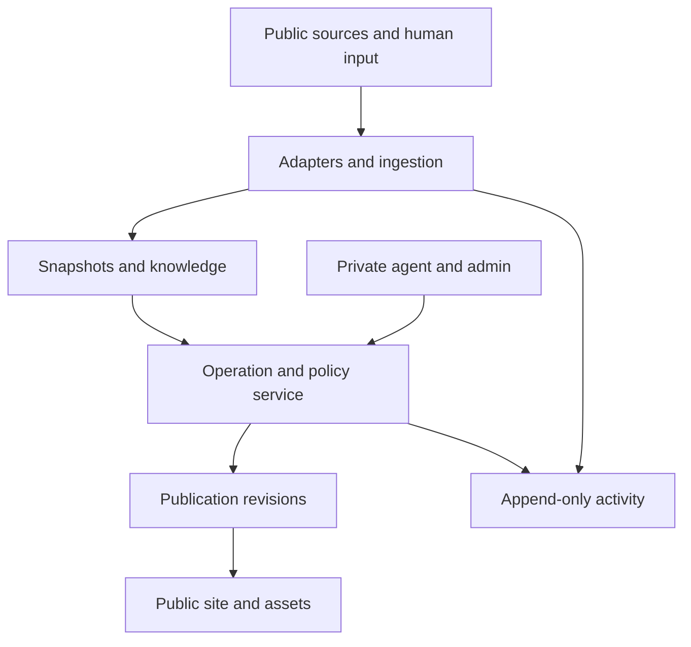

# Alles für die Tiere — Product Plan

**Status:** authoritative product plan, version 1.1  
**Date:** 28 September 2026  
**Public name:** Alles für die Tiere  
**Canonical German domain:** `allesfuerdietiere.earth`  
**Audience:** platform steward, represented person, designer, and engineering team

> **Product proposition:** Malte already creates attention, stories, and projects. The platform maintains a sourced memory of that work, presents the most useful current action, and shows operators exactly what it found, inferred, changed, and published. Routine maintenance runs in the background; editorial direction can be given in ordinary language.

> **Operating premise:** This is a gift maintained technically by Joshua, not software Malte is asked to operate. Reliable automation and the platform steward absorb routine work. Malte uses private chat only for future content that needs his voice, judgment, or direction.

## 1. Decisions and boundaries

This document turns the prior concept into a buildable product. It specifies the system to implement; it does **not** certify any current project facts, partner relationships, rights to media, donation destinations, or upcoming dates. Every seeded public assertion must be checked against a dated source before publication.

### Product goals

1. Move visitors from a story to a clear, legitimate action.
2. Preserve project history and show what happened after earlier campaigns.
3. Refresh selected public facts and events from trusted sources with little manual work.
4. Let Malte direct public content in ordinary language through a conversational interface, while Joshua handles technical maintenance.
5. Make all ingestion, agent activity, and website changes inspectable and reversible.

### Non-goals for the initial release

No public chatbot, supporter accounts, payment processing, new merchandise shop, comprehensive social-history import, arbitrary AI website design, full NGO portal, custom volunteer database, or dependency on private Instagram access. A visitor sent to a partner donation or petition page is recorded as an **outbound handoff**, never as a completed action without independent evidence.

### Two release boundaries

| Release | Operates with | Included | Gate |
| --- | --- | --- | --- |
| **Gift pilot V1** | Carefully verified public sources and public assets with clear original credit | Finished public-ready site, stable `/jetzt`, curated project histories, events, actions, provenance, steward-facing activity/health console, and Malte’s chat | Run the production release behind a temporary password screen for the reveal. Joshua removes that screen when ready; no separate preview build or adoption phase is required. |
| **Adoption V2** | Authorized accounts, originals, and consented integrations | Team roles, authorized Instagram, uploads and voice notes, private drafts, partner submissions, richer notifications | Explicit participation and permissions from the relevant people and organizations |

The operational console runs for Joshua during V1. It must not impersonate Malte, Phia, or management. Malte does not maintain it; he uses chat for all public-content decisions. Warnings give him useful context but never require a second reviewer.

### Gift-pilot experience

The reveal release is a finished, useful site behind a temporary password screen, not an onboarding flow. It contains one stable `/jetzt` action, one or two verified project-memory pages, and a prepared content update. It explains its source approach and that it has no social-account access or automatic posting.

The ten-minute walkthrough shows: the current action and fallback; a project’s lasting story, verified present, and outcome; a private action-change preview; a prepared content draft; and a safe undo. It asks only whether the work is useful and whether the direction is right. It does not ask for credentials, account connections, or routine administration. Joshua removes the temporary screen without a product migration.

## 2. User experience

### Public information architecture

Primary navigation: **Projekte · Helfen · Termine** with **Jetzt helfen** as the persistent primary action. Secondary links: Tiere, Über uns, Partner, Presse, Kontakt, contextual films/music/books, and MAPHIA. Merchandise and direct charitable donations must be labeled distinctly.

| Route | Purpose | Required elements |
| --- | --- | --- |
| `/` | Orient, establish credibility, invite one action | Current campaign, project/animal entry points, selected verified impact, next public event, latest meaningful outcome |
| `/jetzt` | Stable destination for social links | One primary action, supporting context, destination and recipient, optional alternatives, timestamp/expiry where useful |
| `/projekte` | Browse durable work | Curated projects, stage, current need, verified outcome |
| `/projekte/:slug` | Project memory | Why it began, dated milestones, sources, participants, current state, **UND DANN?**, action, related animal/media/events |
| `/tiere/:slug` | Animal-led storytelling | Individual story, related systemic issue, project, specific action; sensitive-media controls |
| `/termine` | Deliberately public activities | Upcoming events with official details and ticket/action links; past events move into history automatically |
| `/presse/:slug` | Reusable facts | Verified summary, dates, people/organizations, metrics with as-of dates, attributed media and sources |

The homepage should support documentary photography, editorial typography, off-white and black foundations, restrained campaign accents, visible captions and dates. Design tokens and component variants are maintained in code. The agent may select an approved presentation variant, not edit CSS or generate layout instructions.

### `/jetzt` behavior

`/jetzt` resolves a scheduled **CampaignPriority** record to a public Action. It shows the final organization and destination before the visitor leaves the site. The destination is validated and stored with a history. An expiry returns to an explicitly configured fallback; it must not leave a broken or empty page. Malte can publish any destination change after seeing its preview; the public URL stays stable while its destination changes.

During the surprise phase, Joshua checks the currently public Instagram bio link and manually aligns the `/jetzt` action with it. There is no Instagram-bio API, login, or scraping dependency. Once Malte uses chat, he changes the platform action there and Joshua can mirror that decision to Instagram only when he has access.

### Internal interface

Joshua uses **Needs Attention**, **Activity**, and **Source Health**. Malte’s primary interface after the reveal is **Chat**. It hides routine technical work and exposes only content decisions in his scope.

- **Needs Attention:** ambiguous claims, sensitive material, conflicting facts, source failures, pending drafts, and publication approvals; sort by impact and age.
- **Activity:** chronological event stream with filters for project, source, origin, status, and public effect. Each row opens the observation, interpretation, structured diff, publication diff, and revert controls.
- **Chat:** accepts ordinary German and links. Malte can create/revise an update, set an approved priority, review a preview, remove media, correct a claim, or ask what needs a decision. It turns intent into a typed private draft, then shows source, public effect, and applicable approval action. Publication always follows an explicit human confirmation/policy.

High-impact decisions arrive as a single mobile-friendly private preview, not a request to open a dashboard. It states what changes publicly, why, what happens without a response, and offers **Freigeben**, **Änderung schicken**, or **Nicht veröffentlichen**. A non-response never publishes content.

### Content maintenance rules

The public site distinguishes durable history from current information. Project pages use: **Warum es begann**, **Was passiert ist**, **Stand heute**, **Und dann?**, and **So kannst du helfen**. Only current status and action require frequent review. Historic work retains its stable page and sources but leaves promotional modules when no longer current.

Each public entity has an accountable content owner, editorial-review date, next review date, freshness class (`live`, `seasonal`, `annual`, `historic`), lifecycle state, and canonical source. Successful polling does not complete an editorial review by itself. The steward dashboard shows only broken/expiring actions, pending reviews, due content, source failures, rights gaps, and unresolved conflicts.

Visitors see a discreet source/as-of date only where it helps them decide whether to act. A stale source preserves verified history and replaces fragile present-tense wording with a dated statement. Changed/cancelled events are shown clearly; broken actions fall back safely; sensitive media requires an intentional reveal. Internal audit and source-run detail never becomes a visitor burden.

The daily summary should state sources checked, changes found, auto-applied, drafted, requiring review, and failures. A zero-change check remains visible in source run history, though it need not flood the main feed.

## 3. Core workflows

### A. Deterministic metric refresh

1. Scheduler checks a source using conditional HTTP headers where supported.
2. Adapter stores request outcome and a raw snapshot when a body is received; extractor records version and normalized value.
3. Validation checks type, unit, source authority, plausible range, and anomaly rules.
4. A proposed operation records the old and new metric, source snapshot, policy decision, and affected surfaces.
5. If policy permits, the operation commits the new metric and a publication revision transactionally. The site is revalidated.
6. Activity displays the source observation, applied change, pages affected, outcome of revalidation, and undo. Failures retain the last verified value with a stale indicator.

### B. Interpretive partner article

The adapter extracts changed article content and links it to a project. A narrowly scoped model may propose a claim with cited passage and confidence. The result enters a private draft. It never publishes merely because a model assigned a high score. An editor reviews the evidence and wording, then approves a publication operation. The Activity chain shows both the earlier discovery and later approval.

### C. Human command

“Make Tierbrücke the main thing until Sunday” becomes a typed proposal with resolved project/action ID, absolute expiry in **Europe/Berlin**, fallback, and affected pages. The application validates the request, previews the visible difference, commits after Malte confirms it, and logs the user instruction, tool invocation, result, and rendered change. Relative dates are resolved at execution time and shown before publication.

### D. Event rollover

An event is stored once. The public upcoming list derives from its interval and publication status; after the event ends, the same record can appear as a past project milestone. No duplicate archive entry is created. Cancellations and changed venues produce prominent diffs, and private locations never enter public event fields.

### E. Revert

An operator selects an operation, sees the reversal preview and intervening changes, and executes a compensating operation. The original audit event remains intact. If later edits make automatic reversal unsafe, the system creates an attention item with a proposed correction; it never silently overwrites newer work.

### F. Chat content contract

The chat is not a general assistant. It supports a finite set of content jobs: sourced project update, current-action priority, wording revision, status/outcome question, correction, media removal, event draft, archive, and pending-approval review. Its sequence is always: restate intended public outcome → prepare draft → show preview/evidence → receive explicit decision → report public result and undo link.

It may learn editable, approved editorial preferences such as concise language or no superlatives. It never claims to write in Malte’s voice, invents a first-person quote, treats a webpage as instructions, accesses infrastructure, scrapes social feeds, connects accounts, or publishes solely because the model proposed a draft. When the model is unavailable, the chat switches to a deterministic in-chat composer for direct edits and known operations; it does not reveal a separate CMS.

## 4. Architecture



**Reference stack:** TypeScript web application, PostgreSQL, scheduled/background worker, object storage for eligible media and compressed source bodies, reverse proxy, and static or cached public pages. A single deployable application plus worker is sufficient initially. Introduce a queue service only when actual throughput or retry requirements justify it. Use schema migrations and separate public/read-only versus internal write paths. The private MCP server exposes validated domain operations to the agent; it is not a general database gateway.

### Service boundaries

| Module | Responsibility |
| --- | --- |
| Source registry | Authority, owner, adapter version, cadence, rate limit, terms/robots notes, publication policy, health |
| Ingestion worker | Discovery, conditional fetch, immutable snapshot, extraction, normalization, deduplication, run outcome |
| Knowledge service | V1 projects, animals, dated claims, metrics, events, actions, media, evidence, provenance, and temporal validity; richer cross-project relations remain an additive future model |
| Operation service | Typed proposals, validation, policy/warnings, duplicate-submission protection, state changes, compensating reversals |
| Publication service | Editorial priority, visibility, content revisions, affected-route computation, preview and deployment state |
| Activity service | Linked event ledger, before/after diffs, initiating session/system origin, source, policy result, site impact, filters |
| Agent gateway | Intent parsing, entity resolution, MCP tool calls, short structured conversation state, explanations |
| Public renderer | Deterministic pages, accessible media reveal, dated facts, cached outputs |

No background task should depend on the conversational model for routine discovery. Use webhook → documented API → RSS/Atom → sitemap → JSON-LD → stable selector → readable main content → browser rendering → model extraction, selecting the first reliable and permitted mechanism per source.

## 5. Data model and invariants

Use UUID or sortable stable IDs, UTC timestamps in storage, explicit display timezone, database migrations, and foreign keys. JSON fields may hold extractor-specific payloads, but domain identity and audit links remain typed columns.

| Entity | Essential fields and relationships |
| --- | --- |
| `Project` | `id`, `slug`, `name`, `summary`, `status`, `visibility`, `started_at`, `current_need`, revision; links to updates, media, events, actions, and evidence |
| `Animal` | `id`, `slug`, public-safe story, project links, visibility, media restrictions; first-class because individual animal stories are a primary public route |
| `Action` | `kind`, project, label, recipient organization, validated destination URL, effective interval, state, evidence, review status |
| `CampaignPriority` | Action ID, rank, start/end, fallback, initiating session, approved revision; no implicit mutation of project facts |
| `Event` | Public title, start/end, timezone, public venue granularity, organizer, official URL, status, visibility, source |
| `Media` | Asset/reference URL, original source/credit, hosting or embed choice, sensitivity, reveal setting, visibility |
| `Source` | Type, URL, owner, authority, adapter/version, polling policy, terms constraints, publication policy, last success, health |
| `SourceRun` / `SourceSnapshot` | Fetch/run IDs, status, headers (`ETag`, `Last-Modified`), fetched time, body pointer/hash, normalized extract/hash, extractor version, error; retention class |
| `SourceChange` | Old/new extract IDs, changed fields, classification, discovered time, resolution status |
| `Claim` | V1 timeline fact: project, optional animal, typed `kind` (`milestone`, `status`, `outcome`, `context`), concise statement, occurred date or bounded interval, visibility, editorial status, and one or more exact evidence links |
| `ClaimEvidence` | Claim, source snapshot, exact passage/value or selector, source publication/observation date, and confidence/authority note; no claim can reach a public timeline without at least one record |
| `Metric` | Key, typed numeric value/unit, project, evidence, fetched/verified times, `stale_after`, allowed range and anomaly policy |
| `ProjectUpdate` | Project, approved copy, linked claims, media, visibility, editorial status; an update may explain several timeline facts without replacing them |
| `Publication` / `PublicationRevision` | Surface/route, content reference, immutable revision, status, published time, rendered diff pointer |
| `Operation` / `OperationStep` | Cause, initiating session, user instruction if any, typed intent, inputs, state, entity and publication diffs, linked source, timestamps, duplicate-submission guard, inverse reference |
| `ActivityEvent` | Append-only event type and time, source/operation/publication IDs, initiating session/system origin, summary, severity, public effect, correlation ID |
| `ConversationState` | Authorized user/session, active project/entity, last operation, unresolved fields, expiry; no need to replay entire chat |

**Invariants:**

- A published factual statement or metric has dated evidence and a visibility decision. A source observation alone is not a publishable fact.
- Knowledge (“what is supported”) and editorial state (“what is featured”) are distinct records.
- An agent cannot directly mutate tables or page code; the operation service validates domain commands.
- Every public revision points to the operation that caused it. Every operation has an immutable activity trail; failed and no-op attempts remain visible.
- A raw source body and extraction version are retained according to retention policy so a parser can be rerun. Hash normalized semantic fields for change detection; do not use whole-page HTML hashes as the publication trigger.
- Facts can be correct at different times. Conflicts are evaluated against validity windows, units, source independence, and authority; a newer secondary article does not silently supersede an authoritative dated statement.
- Every project page derives its **timeline** from the project’s published, dated claims, ordered by occurred date and grouped only for presentation. Timeline copy links back to the claim’s evidence. A timeline is never a manually duplicated second record.
- Visibility is enforced at query and publication boundaries: `private`, `team`, `scheduled_public`, `public`, `archived`. Neither a source fetch nor an agent suggestion promotes visibility automatically.
- A stale or failed source does not erase last verified public content. Precise time-sensitive values are hidden, marked as-of, or rendered in a conservative approved format according to their display policy.

## 6. Publication policy

| Class | Example | Default disposition | Public gate |
| --- | --- | --- | --- |
| Deterministic | Validated official metric within expected bounds | Auto-apply | Known source, unit and range checks, fresh evidence, reversible diff |
| High confidence structured | Official public event feed | Auto-apply eligible | Source-specific validation, public venue, time and URL checks |
| Interpretive | Narrative project milestone inferred from an article or post | Quiet draft | Human verifies passage and wording |
| Sensitive | Allegation, private location, animal-identifying details, graphic media, donation destination | Draft with warning | Malte sees the warning and can publish, hold, or discard it |

Policy is configured per field and source, not merely per source. `known`, `relevant`, `public`, and `featured` are distinct states. Source authority is an input to evidence evaluation, not a universal numeric truth score. Cross-source corroboration can raise a visible warning but does not block Malte’s content decision.

When evidence conflicts, create an attention item, preserve both dated evidence records, keep the last approved display where defensible, and block automatic supersession. The interface identifies which source and validity period each value represents.

## 7. Agent and MCP contract

The agent is a private content interface. Its available tools are semantic and typed. Initial MCP methods:

| Method | Effect |
| --- | --- |
| `projects.get`, `projects.list` | Read published and private-draft project state permitted to the signed-in account |
| `sources.list_changes`, `sources.get_health` | Review ingestion and failures |
| `claims.list_pending`, `claims.prepare`, `claims.publish`, `claims.discard` | Resolve evidence-backed timeline facts and rebuild the affected project timeline preview |
| `actions.preview_primary`, `actions.set_primary` | Preview and set a time-bounded primary action |
| `events.preview_change`, `events.upsert` | Validate public event edits |
| `projects.create_update`, `media.attach_reference` | Create project content with sources and credit state |
| `publications.preview`, `publications.publish` | Show rendered diff, then publish authorized revision |
| `activity.list`, `activity.get`, `activity.diff`, `activity.revert` | Answer audit questions and propose/perform safe reversal |
| `assets.generate_share_card`, `press.generate_fact_sheet` | Render deterministic assets from approved content |

Tools return operation IDs, entity IDs, validation warnings, and affected routes. The active session is recorded automatically and duplicate requests are handled internally. A failed tool call is logged. Tool responses carry a concise user-facing explanation and a linkable activity reference. No raw SQL, arbitrary shell, CSS mutation, or unrestricted HTTP fetch tool is exposed to the model.

For model selection, assemble an evaluation set of realistic commands, including corrections and ambiguity (“Actually make it Friday,” “Don't publish this yet”). Score tool choice, arguments, unnecessary calls, unauthorized actions, and explanation accuracy. Use the least expensive model that passes the required reliability threshold; reserve stronger models for difficult synthesis. The public site has no model dependency.

## 8. Activity and agent logs — primary product surface

The audit design must answer, in order: **What was fetched? What changed in the source? What was extracted or inferred? What policy ran? What data changed? What appeared publicly? Who authorized it? Can it be reversed?**

### Event types and causality

`source.run_started`, `source.fetch_succeeded/failed/not_modified`, `source.change_detected`, `extract.succeeded/failed`, `agent.proposal_created`, `policy.evaluated`, `operation.proposed/approved/applied/failed/reverted`, `publication.previewed/published/failed`, and `source.health_changed`. Correlation IDs connect a run, snapshot, change, agent proposal, operation, and publication revision. This is a linked event ledger, not a model-generated recap.

An `Operation` is persisted before execution with a proposed typed change. Validation and application occur through a transaction or an explicitly tracked saga when rendering/deployment is external. The system records both the database commit and the later route revalidation/deployment result. A page is marked **published** only after the serving layer confirms the new revision. If publication fails after a data commit, Activity shows the discrepancy and queues a retry; it does not claim success.

### Activity row and detail contract

Every prominent row shows time, origin (Malte, Joshua, or system), project/source, action, status, and public effect (`none`, `draft`, `published`, `failed`). The detail view has:

1. **Evidence:** original URL, fetched time, immutable snapshot ID, extracted passage/value, extractor version.
2. **Interpretation:** deterministic rule or model/tool proposal; confidence and rationale as an explanation of inputs, not hidden chain-of-thought.
3. **Decision:** visible warnings/validations, Malte’s publication decision, and timestamp.
4. **Structured diff:** old/new entity fields, units, effective dates, and exact linked records.
5. **Website diff:** affected routes, before/after text or component state, preview captures where useful, deployment state.
6. **Technical details:** redacted tool names/arguments/results, error code, retry count, duration, correlation and idempotency IDs.
7. **Actions:** inspect source, retry eligible failure, view revision, or preview and execute a safe revert.

Example: a metric row states “MA-Forest area: old value → new value; source: Wilderness International; homepage and project page published,” with exact values filled only from verified records. A source failure row states last successful sync, last verified content served, affected surfaces, and retry status. A discovered social reference with no publication explicitly says “Public changes: none; reason: private draft required.”

### Log integrity and privacy

Activity events are append-only at the application layer. Database permissions prevent the application role from rewriting or deleting prior events; privileged retention jobs are separately controlled and logged. Store an event schema version, UTC event time, initiating session, correlation ID, operation ID, previous/new revision pointers, and redacted payload. Protect personal data and tokens: store only necessary instruction excerpts, redact secrets and private addresses before logging, restrict raw snapshots and technical tool-call access to Joshua’s steward console, and apply a documented retention policy. Export and backups must preserve causal links. A revert adds a new event, never removes the original.

### Acceptance tests for Activity

- For any public change, an operator can reach its publication revision, operation, evidence, and original source in no more than a few interactions.
- The daily summary reconciles to the underlying event counts, including failed and unpublished work.
- “What did you change today?” returns only committed and confirmed publication events, separately listing drafts and failures.
- A failed adapter and a rejected agent proposal are visible without implying that the website changed.
- Reverting a campaign priority restores the prior eligible priority or explicitly selected fallback and records the inverse operation.
- Repeated delivery of the same source change produces one applied operation through idempotency.

## 9. Source adapter specification and operations

```ts
interface SourceAdapter<TExtract> {
  discover?(): Promise<DiscoveredItem[]>;
  fetch(item: DiscoveredItem, validators?: HttpValidators): Promise<FetchResult>;
  extract(raw: RawSource): Promise<TExtract>;
  normalize(value: TExtract): NormalizedSource;
  validate(value: NormalizedSource): ValidationResult;
}
```

Build dedicated adapters for the first authoritative sources actually selected during research, rather than committing to every proposed partner upfront. Each adapter has a source-specific fixture corpus (including a changed and broken page), parser version, field-level provenance, conditional request behavior, rate limit, retry/backoff, and health check. A `304` is a successful no-change run. `403`/`429` triggers backoff and a health signal, not repeated aggressive fetches. Respect site terms, robots directives as applicable, and any documented API conditions.

Health states: `healthy`, `degraded`, `failing`, `auth_required`, `parser_broken`, `rate_limited`. Track last attempt, last successful extraction, last verified publication, consecutive failures, and the freshness threshold. Alert on actionable transitions, not every poll. Initial service target: a failing critical source appears in Needs Attention within one scheduled cycle; no invisible stale precision remains beyond its display policy.

For Instagram in V1, curate public URLs or permitted embeds and links manually. Do not make site freshness, deployment, or the data model depend on private API access. An authorized integration is a separate V2 adapter.

## 10. Security, rights, and editorial control

V1 has Joshua’s steward account and Malte’s full-content chat account. Malte can create, revise, schedule, publish, unpublish, and archive all public content through chat; there is no reviewer, role matrix, or two-person approval workflow. Joshua retains infrastructure, source-adapter, credential, and deployment controls. Future accounts are optional and out of scope until needed.

Use private authentication, session expiry, CSRF protection where applicable, least-privilege database credentials, encrypted secrets, backups, and restore drills. Keep source bodies and all non-public operational objects out of the public asset bucket. Public-source media may be hosted or embedded with visible original credit. Sensitive imagery carries severity and a required reveal flag; the public component shows a content warning, accessible reveal action, and safe default preview. Investigation locations, travel, shelters, and private people are private by default.

Analytics measure outbound handoffs without invasive cross-site tracking. If a partner later supplies aggregate completions, label those separately from handoffs. Record consent and retention rules for any optional analytics. Before public deployment, obtain an editorial/legal review of attribution, privacy, imprint and contact requirements, and fundraising language for the actual operating jurisdiction and site owner.

## 11. Initial editorial dataset

Curate a deliberately small set: Tierbrücke, MA-Forest, the Finnish fur investigation, Oßkar and selected animals, trusted organizations, key collaborators, one current action, selected public events, and a few relevant films/music/books. These are **candidate subjects**, not verified statements of current status or affiliation.

For each public entry, maintain a seed sheet with entity ID, wording, original source URL, publication date, observed date, evidence validity period, credit, and last verification date. Use official partner pages for authoritative operational facts and primary first-party statements for personal context where appropriate. The site can launch with fewer entries if some cannot be verified. Never infer an upcoming event from an old announcement.

## 12. Delivery sequence and exit criteria

Sequence represents dependencies, not a promised calendar date. Each stage ends with a demonstrable artifact.

| Stage | Build | Exit criteria |
| --- | --- | --- |
| **0. Reveal release and evidence** | Establish public-source polling, first adapters, media credits, seeded evidence, action destination, branding; build the production release behind its temporary password screen | Seed sheet reviewed; no unsupported public statement; the finished release solves one current-action and one project-memory need |
| **1. Domain foundation** | Schema/migrations, typed IDs, temporal evidence, visibility, evidence links, operation ledger, auth, basic admin | A seeded fact traces to source; a mutation creates auditable operation and revision; session and duplicate-submission tests pass |
| **2. Public core** | Design system, home, projects, animals, `/jetzt`, events, accessible sensitive media, source display, SEO/accessibility | Mobile and desktop journeys work; current action destination is valid; expired action falls back safely |
| **3. Source automation** | Registry, snapshots, 2–3 adapters, fixtures, scheduling, metric/event policies, health and stale rendering | A real source change propagates through validation and Activity; parser failure leaves verified pages live |
| **4. Private control** | Activity, Needs Attention, rendered diffs, chat preview/publish/revert, daily summary | Joshua can explain and undo a change from UI; Malte can publish content from chat; published/failed/draft states reconcile to site state |
| **5. Conversational demo** | MCP server, constrained agent, structured session state, command evals, activity tools | Eval corpus passes agreed safety and accuracy threshold; agent answers changes from audit data |
| **6. Polish and reveal** | Press facts, deterministic share cards, performance, backup/restore, accessibility, editorial review, monitoring, and password-screen removal | Reveal checklist is complete; no critical unresolved source or content issues; rollback rehearsed; Joshua can remove the temporary screen without a redeploy |

The first useful demonstration is available after Stage 2. Stages 3–5 prove the self-maintaining and conversational proposition. If schedule is constrained, reduce the number of seeded stories and adapters before weakening provenance or Activity.

### Engineering work packages

1. Define SQL migrations, typed API contracts, and seed import format.
2. Implement the operation service with idempotent apply, policy, transactional entity revisions, and compensating revert.
3. Implement Activity events and correlation IDs in every ingestion and write path before adding adapters.
4. Build public routes from approved publication revisions and link on-page facts to dated evidence.
5. Build `/jetzt` scheduler, URL validation, expiry fallback, and preview.
6. Implement source registry, fetch/run history, snapshots, normalized hashes, retry/health, and first fixtures.
7. Add one deterministic metric and one structured event flow end to end; then add an interpretive draft flow.
8. Build Needs Attention and Activity with structured and rendered diffs.
9. Expose scoped MCP tools, evaluate realistic commands, and connect Chat to operation IDs.
10. Complete media-credit review, accessibility, source failure exercises, restore drill, and launch review.

## 13. Quality gates and measurement

**Functional gates:** public action resolves to a valid destination; every published fact has evidence; scheduled priority expires safely; event rollover uses one record; sensitive content shows a clear warning before Malte publishes; stale-source behavior retains last verified content; an operation can be explained from its causal log.

**Reliability gates:** fixture tests for each adapter, contract tests for MCP methods, integration tests for duplicate-submission protection, end-to-end tests for `/jetzt` and Activity/revert, backup restore exercise, and a simulated parser failure. Load-test the cached public site against an agreed traffic target after real hosting parameters are known.

**Accessibility and performance:** keyboard access, semantic headings, visible focus, alt text/credits, accessible warning/reveal behavior, and contrast review. Establish page-weight and Core Web Vitals budgets during design and measure them on representative mobile hardware. Avoid making large social embeds block first render.

**Outcome metrics:** report outbound handoffs by action type and route; separately report independently verified completions or partner aggregates when available. Internally measure automatic updates, drafted items, human reviews, time to resolve source failures, stale facts, reversions, and estimated manual tasks avoided. Never label handoffs as completed donations or petitions.

## 14. Verification gates

| Gate | Fixed implementation stance | Verified in |
| --- | --- | --- |
| Public identity and representation | Present as an adopted Malte project with clear original credit/source | Reveal release |
| Current facts, events, recipient URLs | Treat all as unverified seed candidates | Stage 0 editorial research |
| Image and media credit | Host/embed public-source assets where they make sense; show original credit | Before asset publication |
| Precise stale metric display | Define per-metric expiry and fallback text; retain prior record | Before first automated metric |
| Source feasibility | Build an adapter only after its Stage 0 public-web discovery record passes | Stage 0–3 |
| Activity retention and personal data | Apply the fixed retention periods and redacted ledger | Before ingestion production run |
| Accounts | Joshua technical account plus Malte full-content account; additional accounts are deferred | V1 |
| Hosting and deployment details | Coolify, Traefik, SvelteKit, Postgres, SeaweedFS, and worker stack | Foundation |

## 15. Definition of V1 done

The reveal release is ready when Malte can see one stable current action, one curated project with dated outcome and credible source, and the exact boundary of what is and is not public; when Joshua can see a real source check and its effect or non-effect, inspect a website diff, prepare a draft, identify a failing source, and reverse an eligible change; and when the same operation trail supports the agent's accurate answer to “What did you change?” The production release runs behind the temporary password screen until Joshua removes it. The product remains usable when the model is unavailable and when an individual source fails.

The core promise is operational transparency: **the system quietly maintains verified project memory and current actions, while always showing what it observed, what it decided, what it published, and how to correct it.**
