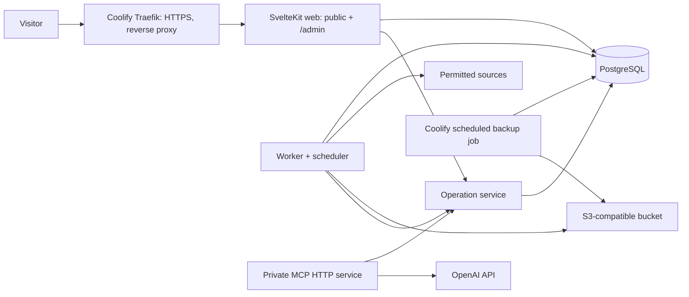

# Alles für die Tiere — Software Implementation Plan

**Status:** proposed build plan
**Date:** 28 September 2026
**Companion:** [product plan](malte-platform-product-plan.md)
**Source strategy:** [content-source-ingestion-strategy.md](content-source-ingestion-strategy.md)
**Design system and public UX:** [website-design-system-and-ux-plan.md](website-design-system-and-ux-plan.md)
**Chat content interface:** [admin-chat-content-interface-plan.md](admin-chat-content-interface-plan.md)

## 1. Delivery decision

Build the German V1 on a new dedicated Frankfurt server running Ubuntu, connected to Joshua’s existing Coolify instance. The server hosts the SvelteKit application, worker, PostgreSQL, and self-hosted SeaweedFS S3-compatible storage. Coolify owns deployment, environment configuration, domain routing, and TLS; the public site never calls OpenAI at request time.

`allfortheanimals.earth` remains reserved for the future English/international site. Until that release, configure an HTTPS `301` redirect to the German domain, preserving the path only where a matching German route exists; otherwise redirect to `/`. Do not publish translated content merely because the domain exists.

This is deliberately a modular monolith. The application, worker, scheduler, admin interface, MCP server, and public renderer share one TypeScript domain package and one PostgreSQL database, with separate runtime processes and database roles. This gives the audit model real transactional guarantees without operating a queue, CMS, search cluster, analytics product, or microservice platform.

### Non-negotiable technical constraints

- Public reads use only approved, published revisions. Drafts, raw snapshots, private locations, and admin routes are unreachable from public queries.
- All changes run through typed operation handlers. Neither the admin UI, MCP server, worker, nor OpenAI API has direct database-write access outside those handlers.
- An OpenAI outage, rate limit, or budget limit affects only optional private drafting and chat. Ingestion, publishing approved content, and the public site continue to work.
- A single low-volume job table replaces Redis and a queue broker. It supports leases, retries, idempotency, and observability with PostgreSQL row locking.
- Public-source media may be rehosted or embedded when appropriate. Every use records the original URL, publisher, observed date, credit, and delivery choice. Object storage remains private; SvelteKit delivers only approved public derivatives.

## 2. Concrete architecture



### Runtime layout

Deploy the following services to the dedicated server through Coolify. Use Coolify’s default integrated Traefik proxy; do not deploy a separate Caddy container. Coolify generates routes and automatic TLS for configured domains, so Caddy would duplicate the same responsibility. [Coolify documents Traefik as its default integrated proxy](https://coolify.io/docs/core/networking/proxy/traefik/overview).

| Service | Image/build | Exposure | Responsibility |
| --- | --- | --- | --- |
| `web` | repository-built Node 22 image | internal | SvelteKit with `adapter-node`; public pages, admin, auth, JSON endpoints |
| `worker` | same application image | internal | scheduled jobs, adapters, asset processing, rendered previews, daily digest creation |
| `postgres` | PostgreSQL 17 image | internal only | relational data, job queue, audit ledger, search indexes |
| `mcp` | same application image | loopback/internal only | authenticated, rate-limited MCP endpoint, calling the same operation service |
| `seaweedfs` | pinned SeaweedFS single-node image | internal S3 endpoint | S3-compatible object storage for raw snapshots, approved public derivatives, private operational objects, and encrypted backups |

Use persistent Coolify volumes for Postgres and SeaweedFS, plus a non-public temporary volume for image conversion. Deploy SeaweedFS in its documented single-node topology with persistent master, volume, filer, and S3 configuration/data paths; record the exact image version and volume mounts in Coolify. It exposes internal S3 buckets/prefixes for `raw/` (snapshots), `private/` (draft uploads), `public/` (approved derivatives), and `backups/` (encrypted backups). Buckets are never internet-accessible. SvelteKit authorizes and streams approved public assets from `public/`; raw/private/backup objects never receive a browser URL.

The dedicated server runs Coolify-managed Docker workloads, SSH, and a firewall. Do not expose Postgres, SeaweedFS, MCP, Docker, or an application debug port to the internet. Coolify’s Traefik proxy is the sole public listener on ports 80/443. The agreed starting server is Frankfurt, Ubuntu, 2 GB RAM, and 40 TB storage. Set restart policy `unless-stopped` and explicit limits: Postgres 640 MiB, web 384 MiB, worker 384 MiB, SeaweedFS 384 MiB, MCP 192 MiB. This leaves headroom for Traefik, Docker, and Ubuntu. Run one image-derivative job at a time and keep worker concurrency at one until monitoring shows safe headroom.

### Network and DNS

1. Point `A` and `AAAA` records for `allesfuerdietiere.earth` and `www` to the dedicated server. Configure both in Coolify; its integrated proxy obtains TLS certificates.
2. Use Coolify’s canonical-domain redirect for `www` to the apex and its HTTP-to-HTTPS routing.
3. Point the international apex and `www` to the dedicated server. The application returns the temporary international-domain redirect to the German site.
4. Keep only configured Coolify domains routed to the application; unknown hostnames receive no application route.
5. Allow ports 22, 80, and 443 in the host firewall. Restrict SSH to key authentication; disable password and root login.

Use the DNS provider already included with the domains unless an existing DNS service is preferred. A CDN is not required for V1. If real traffic later makes it useful, Cloudflare's free plan can be placed in front of Coolify’s Traefik proxy without changing application URLs.

## 3. Repository and application shape

Create a pnpm workspace with the following boundaries. Keep it a single deployable repository until a measurable scaling or team need argues otherwise.

```text
apps/
  web/                 SvelteKit routes, server hooks, admin UI, public components
  worker/              worker entry point and scheduler loop
  mcp/                 MCP transport entry point
packages/
  domain/              entities, operation handlers, policies, and events
  db/                  Drizzle schema, migrations, repositories, transactions
  adapters/            source-specific fetch/extract/normalize/fixtures
  content/             rendering models, MDX/content validation, share-card renderer
  contracts/           Zod schemas shared at all process boundaries
  observability/       structured logs, redaction, correlation IDs
infra/
  compose/             Coolify Compose definition and service configuration
  scripts/             explicit operational scripts only
```

Use TypeScript in strict mode, SvelteKit with `@sveltejs/adapter-node`, PostgreSQL 17, Drizzle ORM plus SQL migrations, Zod for runtime contracts, and plain CSS using tokens and component-scoped styles. Use SvelteKit form actions for admin mutations and server-side rendering for public routes. Do not introduce Tailwind, a headless CMS, GraphQL, or a client data-fetching framework in V1.

Use MDX only for editorial long-form drafts if it materially improves writing; render it through a strict component allowlist. Core facts, actions, events, visibility, and provenance remain relational fields, never free-form MDX front matter.

## 4. Domain model implementation

The product plan's entities remain authoritative. Implement them in four migration groups so each vertical slice is independently testable.

| Migration group | Tables | Key implementation details |
| --- | --- | --- |
| V1 core | `users`, `sessions`, `projects`, `animals`, `media`, `events`, `actions`, `campaign_priorities`, `project_updates` | application-generated UUIDv7 IDs stored as `uuid`, `timestamptz` in UTC, visibility enum, `created_at`/`updated_at`, optimistic `revision` column |
| Evidence and sources | `sources`, `source_runs`, `source_snapshots`, `source_changes`, `claims`, `claim_evidence`, `metrics`, `evidence_links` | snapshot object key and SHA-256; exact passage/selector; claim occurred date/interval, kind, project, optional animal, visibility, and editorial status; `verified_at`, validity interval, freshness policy |
| Publication and audit | `publications`, `publication_revisions`, `operations`, `operation_steps`, `activity_events`, `attention_items` | immutable event payload JSONB with schema version, correlation ID, request hash for duplicate protection, canonical public rendering payload, and template version stored per publication revision |
| Runtime | `jobs`, `job_attempts`, `conversation_states` | job lease owner/until, retry schedule and unique dedupe key |

Use database foreign keys and check constraints for relationship integrity. Add partial indexes for public entities, published dated claims by project, active campaign priorities, unresolved attention items, jobs ready to run, and activity filters. Use PostgreSQL full-text indexes only after public content exists; an initial database search is sufficient. V1 includes the focused project-timeline claim graph: claims connect a project and optional animal to exact evidence and a date/interval. Defer generic roles, API credentials, notifications, standalone people/organisation records, and broader cross-project relationship graphs.

The public renderer builds each project timeline from published claims rather than a separately maintained timeline table: query claims by project and visibility, order by `occurred_at`/interval, group adjacent same-date claims for display, and render every entry with its source/as-of link. A source change can prepare claim drafts, but only a published claim changes a public timeline. Rebuilding the timeline happens in the same publication operation as the claim, so the Activity diff lists the entries and routes affected.

Every public-facing content entity additionally has `content_owner_id`, `last_editorial_reviewed_at`, `next_review_due_at`, `freshness_class`, and `lifecycle_state`. These fields drive the content-health dashboard independently of source polling. Retain slug redirects and an optional `supersedes_id` for renamed or replaced entries; do not break durable shared links.

### Write and publication transaction

Every operation follows the same sequence:

1. Validate the signed-in session, Zod input, entity revision, destination format, and relevant publication policy/warnings.
2. Insert `operations` in `proposed` state and append `operation.proposed` activity within a transaction.
3. Write entity revisions and any publication revision, then append `operation.applied` activity in the same transaction. Repeated idempotency keys return the original result.
4. Commit the canonical public rendering payload, template version, and affected routes; verify the server renderer can render it. Record `publication.published` only after confirmation. Route responses use ETags and explicit HTTP cache headers, so an optional future shared cache naturally revalidates. Rendering failure creates a retryable job and an attention item.
5. Revert by creating a new compensating operation. It checks that the requested fields still have the expected revision before applying; otherwise it proposes a correction preview.

Database access is separated into `app_read`, `app_write`, `worker_write`, and `migration_owner` roles. Application services may append activity events but cannot update or delete them. A privileged, separately invoked retention migration is the only exception and records its own event.

## 5. Public and admin implementation

### Route map

Implement public routes from the product plan plus `/impressum`, `/datenschutz`, `/robots.txt`, `/sitemap.xml`, and `/healthz`.

Before the reveal, a single application-wide gate appears before every public route. It verifies one hardcoded password held in Coolify environment configuration and sets a short-lived signed cookie. It is a temporary reveal screen, not an authentication or security boundary: do not build account recovery, rate limiting, user management, or an access log for it. Joshua removes the gate through one environment flag without changing routes, content, or deployment topology.

- Render published public pages server-side from immutable publication payloads. Set route-specific `Cache-Control` and ETag headers; Coolify’s integrated proxy provides routing/TLS, not a purgeable dynamic response cache. HTML must carry its publication revision in a non-visible response header for diagnostics.
- Render source citations with a human-readable publisher, date, and outbound link. Do not expose raw source object URLs.
- Render `as of` dates where freshness policy requires them. A stale precise metric becomes the policy's conservative fallback text, never an invented current value.
- Use short-lived presigned upload URLs and a post-upload verification job, so the web process never proxies large media files. Generate bounded image derivatives (`avif`/`webp` plus original where needed), explicit dimensions, alt text, credit, caption, and a safe sensitive-media reveal component.
- Track only same-site outbound handoffs: action ID, route, anonymous daily salted visitor token, and timestamp. No third-party analytics script or cross-site identifier.

Admin routes live under `/admin`, use SSR, and have `noindex`, `Cache-Control: no-store`, CSRF validation, secure HTTP-only session cookies, session rotation, and rate-limited login. Start with Joshua’s steward account and Malte’s full-content chat account, using Argon2id password hashes and mandatory TOTP. Malte lands in chat, not the steward console. There is no reviewer or two-person approval workflow. This avoids making email delivery a launch dependency. Account recovery is a documented administrator procedure until a transactional email provider is explicitly chosen.

The steward console navigation is **Übersicht**, **Inhalte**, **Aktuelle Hilfe**, **Termine**, **Quellen**, and **Verlauf**. Übersicht groups public-impact work into Heute wichtig, Zur Prüfung, Pflege fällig, and Alles aktuell. The first pages include content templates for project updates, actions, events, media, and press facts; source health/detail; content health; publication preview; and safe revert preview. Content health groups entries by owner and shows overdue editorial reviews, stale values, unknown-rights media, broken action links, and orphaned assets. Drafts autosave privately, while publication always requires an explicit preview/submit action. Malte sees the chat-first interface defined in the chat plan. Build desktop-first for the steward and use clear German labels; retain audit and technical terms behind a Details control rather than exposing them as the primary UI.

## 6. Scheduling, source ingestion, and retention

The worker runs continuously but uses the `jobs` table as its scheduler. On startup and once per minute it claims due jobs using `FOR UPDATE SKIP LOCKED`, sets a lease, and executes within a bounded timeout. A watchdog requeues expired leases. Each job has exponential backoff with jitter, max attempts, a source-specific rate limit, and a dedupe key. This works with one worker today and multiple worker replicas later without a new service.

Initial job kinds: `source.capture`, `source.poll`, `source.extract`, `source.evaluate_change`, `publication.verify`, `asset.derivative`, `daily.summary`, and `backup.verify`. Keep adapter fetches deterministic and source-specific: `fetch` → immutable snapshot → extract → normalize → validate → change comparison → policy. A `304` is a successful source run; `403`/`429` pause the source according to its configured backoff. A link pasted in chat creates a private `source.capture` job using the same SSRF-safe fetcher; it produces evidence and a draft preview, never a direct publication.

Implement two adapters first, only after a Stage 0 discovery spike records the canonical URL, update format, extractable fields, cadence, rate limit, fixture, and safe fallback for that exact source. The detailed source register, policies, polling limits, and V1 social-media boundary are defined in [the content-source ingestion strategy](content-source-ingestion-strategy.md):

1. The Wilderness International MA-Forest counter, run in observation-only mode for 30 days before enabling its narrowly approved metric policy.
2. One Tierbrücke or Notpfote public-web source whose Stage 0 result demonstrates a stable canonical page, feed, structured data, or narrowly scoped HTML extraction. It creates evidence-backed drafts unless a field-specific policy permits otherwise.

The third adapter is an interpretive article source that produces private evidence-backed drafts only. Every adapter has local fixtures for unchanged, changed, malformed, unavailable, and rate-limited responses. Record adapter and extractor versions in each run.

Retention is fixed: retain source-run metadata and audit events for the life of the platform; retain raw public-source bodies for 24 months; keep rejected draft payloads for 90 days; do not accept private uploads in V1; retain encrypted backups for 30 daily, 12 monthly, and 2 yearly restore points. Apply lifecycle rules in SeaweedFS and log every deletion batch.

## 7. MCP and agent layer

Expose the MCP server only through a private authenticated path or private network tunnel. It is an internal tool server, never a public endpoint and never embedded in the visitor experience. Verify the active signed-in chat session, session expiry, request size, and rate limit before any tool invocation. There is no user-facing API-key, role, or approval-key flow.

Implement read-only tools first: project lookup, pending content, activity summaries and diffs. Add one mutation at a time: project-timeline claim draft/publish, project-update draft, `actions.preview_primary` and `actions.set_primary`, then event upsert, publication preview/publish, and finally revert. All mutating tools create a draft or preview first. A chat-originated publish requires the user to press the explicit confirmation shown on that exact preview; the system prevents duplicate submissions internally. Warnings for sensitive or uncertain content are visible but do not require another reviewer.

The agent service owns only intent-to-tool translation and a brief server-side conversation state. It receives minimal, redacted context and calls the approved OpenAI model through a budgeted API client. Store tool inputs and a concise generated explanation, not hidden reasoning. The OpenAI account enforces the €50 monthly API budget. The Joshua dashboard displays month-to-date estimated and reported usage, request count, and the configured provider limit. Per-request token caps remain application configuration; when the provider limit is reached, chat enters its deterministic fallback mode while all non-agent functions continue.

Before enabling mutations, create a versioned evaluation corpus of at least 40 German commands: normal commands, date ambiguity, corrections, invalid destinations, attempts to publish sensitive facts, duplicate requests, and audit questions. Record tool choice, argument validity, policy outcome, and explanation accuracy. Enable a mutation only when its evaluation threshold is met and Joshua has manually exercised its preview and revert path.

## 8. Security, backup, deployment, and monitoring

Store production secrets in Coolify environment configuration; mount each service only the secrets it requires. Rotate database, SeaweedFS, OpenAI, and MCP credentials independently. Encrypt backups before upload with an age recipient key held separately from the dedicated server. Keep a second copy of the recovery key offline.

Run nightly `pg_dump` in custom format through a Coolify scheduled job, upload encrypted dumps to SeaweedFS `backups/`, and take a weekly verified restore into a temporary local database. Include an object manifest and the current migration version in every backup. Multi-server recovery storage is a future addition and is not a V1 requirement. Run a quarterly manual restore drill into an isolated Coolify environment and record its outcome in Activity. Database dumps do not replace object-storage lifecycle/versioning.

Coolify deploys separate `web`, `worker`, `postgres`, `mcp`, and `seaweedfs` resources from the approved repository/image configuration to the dedicated server. The application connects only through Coolify internal service hostnames and credentials. Migrations are versioned code and run as a one-shot pre-deploy job before `web` starts; `/healthz` verifies each release. Coolify scheduled jobs handle backups; the worker’s PostgreSQL job table handles application work. Retain the two prior deployment versions in Coolify for rollback. Do not auto-deploy unreviewed main-branch changes at launch.

Emit JSON logs to stdout with correlation ID, request ID, route/job name, duration, status, and redacted error code. Coolify/Docker log rotation prevents disk exhaustion. Proxy access logs and application errors remain local for a short period; health status and daily summaries live in Postgres. Joshua’s private technical dashboard is the only alerts/monitoring surface. If a chat or ingestion failure affects Malte, chat shows only “Joshua kümmert sich darum” plus a plain-language reason and contact action; it never exposes technical logs or tasks.

## 9. Build sequence and acceptance gates

| Phase | Deliverable | Acceptance evidence |
| --- | --- | --- |
| 0 — Foundation | repository, Coolify stack, Traefik routing, DB migrations, accounts/TOTP, deploy/backup scripts | fresh-server runbook works; HTTPS and health checks pass; test restore succeeds |
| 1 — Auditable content core | projects, animals, dated timeline claims, actions, events, sources, evidence, operation/activity ledger, seed importer | a seeded public fact traces from page to evidence and operation; its project timeline derives from the published claim |
| 2 — Reveal-ready public-site core | all V1 public routes, `/jetzt`, responsive design, accessibility/SEO/legal routes, handoff events, and temporary password screen | keyboard/mobile checks; invalid or expired action resolves safely; production content is complete behind the temporary screen |
| 3 — Maintainer control | Joshua dashboard, source health, attention workflow, diffs, preview and compensating revert | Joshua changes an eligible action and safely reverts it from the UI |
| 4 — Automation | job queue, two adapters, fixtures, snapshot storage, stale policies, daily summary | source change auto-applies only where policy allows; broken parser preserves live content |
| 5 — Agent | private MCP read tools, evaluation corpus, selected mutation tools | all enabled tools meet the agreed eval threshold and link Activity records |
| 6 — Reveal and screen removal | password-screen toggle, monitoring, performance and restore rehearsal | Joshua can remove the screen without redeploying; rollback is rehearsed |

Work vertically. Finish a small seeded project, its evidence, one public page, one admin edit, activity entry, and revert before adding more entity types or adapters. The first live release should contain fewer fully evidenced stories rather than broad unverified coverage.

### Required automated checks

- Unit tests: policy functions, visibility checks, URL validation, freshness calculation, operation inverse generation, and redaction.
- Database integration tests: transaction rollback, duplicate-submission protection, append-only activity permissions, and job leasing.
- Adapter fixture tests: unchanged, changed, malformed, `304`, `403`, `429`, and extractor version change.
- Playwright end-to-end tests: `/jetzt` fallback, source citation, admin TOTP session, approval/publish, Activity causal trace, and revert conflict.
- Accessibility checks: automated axe scans plus manual keyboard, focus, screen-reader labels, and sensitive reveal interaction.
- Maintainer usability checks: Malte completes a sourced update, `/jetzt` replacement, direct text replacement, project archive, and mistake recovery on a phone through chat; Joshua completes source diagnosis and recovery through the private dashboard.
- Deployment checks: migration against a production-like dump, container health, backup upload, and restore verification.

## 10. Maintainer runbook design

Keep daily operation comprehensible from one page:

| Situation | Maintainer action | System behavior |
| --- | --- | --- |
| No changes | review daily summary if desired | records successful checks without noisy feed rows |
| Source failed | open Needs Attention, inspect last good run, retry or pause source | keeps last verified content under its stale display policy |
| New trustworthy fact | attach source, create private draft, verify wording, publish preview | creates linked evidence, operation, revision, and Activity events |
| Current action changes | preview priority, inspect recipient and expiry/fallback, approve | validates destination and makes `/jetzt` stable |
| Published mistake | open Activity event, choose Revert, inspect conflict preview | creates a compensating operation; never erases history |
| Server alert | open health route and service logs; follow documented restore/rollback command | protects database and prior container image |

Write these procedures as short German runbook pages in `docs/operations/` while implementing their respective feature. Each page includes purpose, safe command or UI path, success signal, failure signal, and escalation contact. No operation should require remembering ad-hoc shell commands.

## 11. Cost controls and future expansion

The ongoing baseline cost is the already owned domains, the new dedicated server, and its self-hosted SeaweedFS storage. Everything else in V1 is self-hosted through Coolify. OpenAI remains a variable, optional cost with a **€50 monthly cap**; disable agent calls when it is exhausted. Reduce raw-snapshot retention before adding storage costs, while preserving verified evidence and backups.

Do not add a separate international codebase. Internationalization starts later with locale-aware routes and a `content_translations` table keyed by entity, revision, and locale; each locale has its own editorial translation workflow, evidence links, and publication revision. Keep German copy as `de` now, even if no English fields are yet exposed, so this expansion is additive.

### Explicit deferrals

- Authorized Instagram integration, partner self-service, uploads/voice notes, and team invitation flows belong to V2.
- Public search, newsletter delivery, push notifications, payments, supporter accounts, and a public chatbot are not V1 dependencies.
- Browser automation is a last-resort, source-specific adapter technique. It does not run as a general scraping service.

### Scale only from measured need

The modular monolith is sufficient for V1: hundreds of public entries, thousands of media references in object storage, 2–10 sources, a few concurrent editors, and hundreds of short jobs per day. Review the architecture only when a real threshold persists: source freshness windows are missed or leases expire (add a worker); web CPU/memory or public latency remains high during campaigns (optimise payloads, then add a CDN/web replica); database CPU/IO remains high (index/profile, then isolate Postgres); or more than five editors/20 sources create recurring workflow friction. Do not add Redis, a search cluster, microservices, or a new queue before evidence justifies it.
